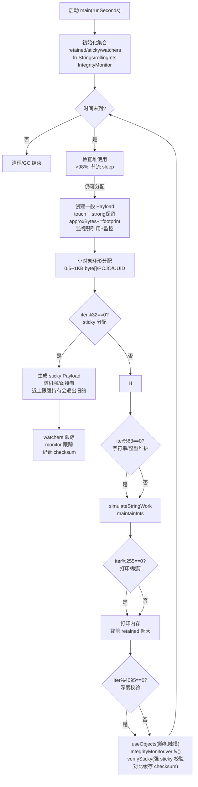

# LongRunningAppSim

长时间运行的堆压力模拟器，混合多种对象类型（byte/int 数组、字符串、链式图、组合对象、Map/ByteBuffer、用户会话 POJO、消息批次等），并带有强/弱引用混合、完整性校验、节流策略与黏性（长期保留）对象。运行时会缓慢逼近堆上限，周期性校验对象内容是否被意外篡改。

## 构建与运行

```bash
make -C LongRunningAppSim
dalvikvm64.sh LongRunningAppSim/dex/LongRunningAppSim.dex [runSeconds]
```

`runSeconds` 可选。

## 流程概览（Mermaid）



## 要点

- **对象多样性**：常规分配增加了 MapPayload、用户会话 SessionPayload、ByteBuffer BufferPayload、消息批次 MessageBatchPayload 等实际业务常见对象，sticky 路径也会混入这些组合。
- **黏性对象**：混合大小/层级的 payload；强持有时进入 `sticky` 并缓存 checksum；弱持有仅通过弱引用监控 GC 行为。
- **完整性校验**：`IntegrityMonitor` 保存初始 checksum，周期性比对每个对象并做聚合 checksum 比对；粘性对象也会单独比对缓存的 checksum，保证每轮 verify 都走 checksum。
- **节流策略**：堆使用接近 98% 时暂停分配，避免过早 OOM。
- **小对象压力**：额外的环形 0.5~1KB 分配增加碎片化与分配频率，类型涵盖 byte[]、TinyPojo、UUID、时间戳对象等。
